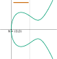
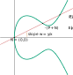

# A Geometrical Introduction to Double-Odd Elliptic Curves

To give an intuition about double-odd elliptic curves, why we use them
and how we leverage their structure, we present here a geometrical
interpretation.

For use in cryptography, we work over a finite field \\(\mathbb{F}_q\\)
of order \\(q\\), typically integers modulo a given prime. All we
explain here also works over field extensions, in which case \\(q\\) is
a given power of a prime integer (called the *field characteristic*).
The only restriction is that the characteristic should not be 2 or 3
(elliptic curves over such fields use different equations and rules).
However, finite field are not very visual; the pictures below *pretend*
that we are using real numbers, where there are such things as
continuous functions. These pictures are still useful in getting used
to the underlying ideas.

## Motivation

### Short Weierstraß Curves

Let's start with a classic "short Weierstraß" curve and the definition
of point addition, as show below.

The curve here is the set of points \\(x, y\\) that fulfill the
curve equation \\(y^2 = x^3 + Ax + B\\) for two given constants \\(A\\)
and \\(B\\) that define the curve shape. As is well-known, *every*
elliptic curve can be converted into that kind of shape and equation
with appropriate changes of variables.

Point addition is defined as follows:

  - The neutral element is the formal extra "point-at-infinity" (which
    is not in the plane and does not have coordinates).

  - For a point \\(P\\), the point \\(-P\\) is the symmetric of the
    point relatively to the horizontal axis.

  - When adding two points \\(P\\) and \\(Q\\) together, the line
    \\((PQ)\\) is drawn; it intersects the curve in a third point
    which is \\(-(P+Q)\\), i.e. the opposite of the sum of \\(P\\)
    and \\(Q\\).

This is illustrated by the red lines on the figure. Given the
coordinates of \\(P\\) and \\(Q\\), the coordinates of \\(P+Q\\) can be
computed as rational functions of \\(P\\) and \\(Q\\), with coefficients
that depend only on the curve parameters. Unfortunately, this process
has *exceptional cases* which must be handled differently:

  - The point-at-infinity does not have defined coordinates, so it
    can be hard to apply rational functions on these non-existing
    coordinates.

  - When \\(P = -Q\\), the line is vertical \\((PQ)\\) and the third
    intersection point is "at infinity", again with no defined
    coordinates.

  - When \\(P = Q\\) (i.e. a *point doubling*), the line \\((PQ)\\) is
    not well-defined; if we apply the rational functions that compute
    point addition in general, we end up dividing zero by zero. Instead,
    we have to use the tangent to the curve on \\(P\\), and this leads
    to different rational functions to obtain the result.

These exceptional cases are mightily inconvenient. The point-at-infinity
can somehow be handled by switching to fractional coordinates, in which
each coordinate is represented by a fraction. In that case, infinity
corresponds to a denominator value of zero. There are several well-known
systems of coordinates that use fractions, e.g. *projective coordinates*
(\\((x, y) = (X/Z, Y/Z)\\)) or *Jacobian coordinates* (\\((x, y) = (X/Z^2,
Y/Z^3)\\)). Formulas working on fractional coordinates can be
established, that will handle infinities, and have the added benefit of
allowing most computations to be done only with additions, subtractions
and multiplications, and no divisions. A single division will be needed
only at the end of a long computation, usually for encoding a point into
a well-defined sequence of bytes. This promotes performance, because
divisions are more expensive than multiplications. The *cost* of
formulas is thus often expressed as a number of multiplications; it is
common practice to separate general multiplications from squarings, the
latter being usually somewhat faster than multiplications.

Handling the exceptional case related to point doublings is harder. This
case can be detected with a simple test, but this leads to conditional
execution, i.e. non constant-time behaviour, which is unsafe in all
generality (timing attacks will detect that occurrence which may lead to
information leaks). In general, one can apply *both* formulas, for
general addition and for doubling, and select the right one afterwards
in a constant-time way, but this is expensive. *Complete formulas* that
do not have exceptional cases, in projective coordinates, [have been
published](https://eprint.iacr.org/2015/1060); they allow safe
implementations of any curve (of odd order), but at a cost: each point
addition requires 12 multiplications in the field (12M), while
specialized doubling formulas (when the two operands are statically
known to be the same point) need 8 multiplications and 3 squarings
(8M+3S). If we forego completeness, Jacobian coordinates lead to more
efficient formulas (especially doublings, in cost 3M+5S), but analysis
becomes a lot harder because we must prove that no exceptional case may
be inadvertently reached when using incomplete formulas. This can lead,
and has led, to exploitable vulnerabilities.

Apart from this tension between performance and safety, short Weierstraß
curves can have nice characteristics:

  - The order of a curve is close to that of the field, but can be about
    any integer in a range centered on that value, so that we may choose
    curves with a prime order. Higher-level cryptographic
    functionalities building on elliptic curves usually need a prime
    order group.

  - With point compression, elements of a curve with \\(2n\\) points and
    offering "\\(n\\)-bit security" can be encoded over \\(2n+1\\) bits.
    This is the best one can realistically hope for with elliptic
    curves.

### Twisted Edwards Curves and Montgomery Curves

*Twisted Edwards curves* use a different kind of polynomial equation (of
degree 4) that leads to the shape shown here; the point addition rule is
somewhat different and harder to represent on a picture (I won't try).
They are still elliptic curves, though, and therefore they can be turned
into a Weierstraß curves with a birational transform on coordinates. As
Weierstraß curves, twisted Edwards curves become *Montgomery curves*
(which were historically discovered before Edwards curves). A well-known
Montgomery curve is Curve25519 (defined over the field of integers
modulo \\(2^{255}-19\\)) and its twisted Edwards counterpart is called
Edwards25519. The [Ed25519 signature
algorithm](https://tools.ietf.org/html/rfc8032) uses Edwards25519, while
the [X25519 key exchange algorithm](https://tools.ietf.org/html/rfc7748)
works over Curve25519. From a security point of view, they are the same
curve.

The most interesting aspect of twisted Edwards curves is that point
addition can be expressed with formulas that have no exceptional cases,
and these formulas are substantially more efficient than the ones for
short Weierstraß curves (8M for general point addition, 4M+4S for point
doubling).

They have, however, a drawback, which is the *cofactor*. A twisted
Edwards curve cannot have prime order, since its order is always a
multiple of 4. The ratio between the curve order and the prime order of
the subgroup which is relevant to cryptographic applications is called
the cofactor. The cofactor for Edwards25519 is 8. The cofactor tends to
be a nuisance for cryptographic protocols, because it allows the
existence of several "equivalent" points that still look different from
each other on the wire. This can lead to several issues, e.g.:

  - The cofactor induces public key malleability, which was exploited in
    a [double-spend
    attack](https://www.getmonero.org/2017/05/17/disclosure-of-a-major-bug-in-cryptonote-based-currencies.html)
    on the Monero cryptocurrency.

  - Several equations are possible to validate Ed25519 signatures, and
    while they have equivalent security, they imply that it is possible
    to (maliciously) make signatures that will be accepted by some
    verifiers, and rejected by others. This tends to break [consensus-based
    distributed applications](https://zips.z.cash/zip-0215).

For more cases and extensive analysis, see [this report from Cramer and
Jackson](https://eprint.iacr.org/2019/526). The gist of it is simple: we
need a prime order group. When using a curve with a non-trivial
cofactor, the low-order points and the malleability *may* require some
corrective actions, which is usually a generous sprinkling of
multiplications by the cofactor in various place of the upper protocol,
and explicit detection of the few points whose order is a divisor of the
cofactor. Even when such mitigations are not required, some extensive
and non-obvious analysis is needed to ascertain this fact. In that
sense, a lot of the apparent simplicity of use of twisted Edwards curves
has been obtained not by removal of complexity, but by moving it into
upper layers of the overal protocol design.

### Decaf and Ristretto

[Decaf and Ristretto](https://ristretto.group/) are an *almost* perfect
solution to the cofactor issues with twisted Edwards curves. They are
applicable to such curves when the cofactor is exactly 4 (for Decaf) or
8 (for Ristretto). With Decaf/Ristretto, what you decode is a point on
the twisted Edwards curve, which is not necessarily a member of the
prime order subgroup on that curve. However, all points that differ from
each other by only a low order point will encode to the same sequence of
bits, and any two points that encode to a given sequence of bits differ
from each other by only a low order point. This leverages all the
performance and completeness of formulas on twisted Edwards curves, but
provides the required abstraction for building higher-level
cryptographic functionalities: a prime order group with a canonical and
verified encoding.

There are a few remaining points where Decaf/Ristretto is suboptimal:

  - The decoding and encoding processes both use an inverse square root
    in the field, which is implemented with a modular exponentiation,
    with a non-negligible cost. Ordinary twisted Edwards curves, and
    short Weierstraß curves, also need a square root for decoding
    (when using a compressed encoding format), but for encoding they
    "only" need an inversion. Inversion is traditionally implemented
    with Fermat's little theorem, i.e. another exponentiation, but
    [faster methods exist](https://eprint.iacr.org/2020/972). Decaf
    and Ristretto cannot leverage that.

  - The cofactor still requires some space: for \\(n\\)-bit security,
    the curve must work over a field of size \\(2n+2\\) bits (for Decaf)
    or \\(2n+3\\) bits (for Ristretto), leading to the same size
    requirement for encoding.

And, more generally, while the currently known formulas for twisted
Edwards curves are fast, nothing proves that one cannot be better.

## Double-Odd Elliptic Curves

Enter double-odd elliptic curves. This started with a question: since
short Weierstraß curves can have prime order, but Montgomery/Edwards
curves have cofactor at least 4, what of the "intermediate" curves with
cofactor 2? Is there anything that can be done with them?

It turns out that such curves, which we named *double-odd elliptic
curves*, have interesting properties that help in both finding a
canonical encoding for a prime order group (in a way similar to
Ristretto) while also giving options for unified and complete formulas.
It so happens that the resulting formulas are also quite fast, in
particular with regard to computing point doublings -- and point
doublings tend to represent the large majority of the cost of point
multiplication by a scalar, so any gains in that area are most welcome.

### Curve Equation and Point Encoding

Let's consider a curve \\(E\\) with order \\(2r\\) for some odd integer
\\(r\\) (in practice, we'll choose a curve such that \\(r\\) is prime).

A double-odd curve necessarily has a single point of order 2, i.e. a point
which, added to itself, yields the point-at-infinity. Equivalently, points
or order 2 are points with \\(y = 0\\). Let's call that point \\(N\\).

With a simple change of variable (adding a constant to the \\(x\\)
coordinate), we can always arrange for \\(N\\) to be the point \\((0,
0)\\), as illustrated on the figure. This transform the curve equation
into another form which is similar but not identical to short Weierstraß
equations: \\(y^2 = x(x^2 + ax + b)\\) for two constants \\(a\\) and
\\(b\\).

Mathematical analysis shows that for all double-odd elliptic curves, we
get such an equation such that neither \\(b\\) nor \\(a^2 - 4b\\) is a
square in the field. The converse is also true: all curves with equation
\\(y^2 = x(x^2 + ax + b)\\) with non-square \\(b\\) and \\(a^2 - 4b\\)
are double-odd curves.

Given a double-odd elliptic curve with order \\(2r\\), there is a subgroup
of order \\(r\\), which consists in all the points that, multiplied by
\\(r\\), yield the point-at-infinity. This subgroup is called the
*points of \\(r\\)-torsion* and is traditionally noted \\(E[r]\\).
In particular, for any point \\(P\\) on \\(E\\):

  - if \\(P \in E[r]\\), then \\(P + N \notin E[r]\\);
  - if \\(P \notin E[r]\\), then \\(P + N \in E[r]\\).

The subgroup \\(E[r]\\) has order \\(r\\) (which we chose to be prime) so
this looks like the prime order subgroup we want to use for cryptography.

Let's now consider a point \\(P\\) on the curve (distinct from \\(N\\),
and not the point-at-infinity either), and the addition of \\(N\\) to
\\(P\\).

By the geometrical definition of the point addition, we draw the line
\\((PN)\\), which then intersects the curve on a third point, which is
\\(-(P+N) = (-P)+N\\). Crucially, exactly one of \\(P\\) and \\(-P+N\\)
is a point of \\(r\\)-torsion. Since the line \\((PN)\\) goes through
\\(N\\) (which is at a fixed, known position) and is not vertical
(because \\(N\\) is the only point with \\(x = 0\\)), that line is
uniquely defined by its slope \\(w = y/x\\). Thus, for a given slope
value \\(w\\) that defines a line through \\(N\\):

  - either this line does not intersect the curve in any other point;

  - or it intersects the curve in exactly two points, exactly one of
    which is in \\(E[r]\\).

This means that the mapping of a point \\((x, y) \in E[r]\\) into
the slope value \\(w = y/x\\) is **injective**. Thus, it can potentially
be used to unambiguously encode elements of \\(E[r]\\).

How about decoding? It so happens (this is not obvious geometrically) that
an extra property applies here: for any \\(P = (x, y) \in E\\), with
\\(P \neq N\\) and not the point-at-infinity, then \\(P \in E[r]\\) if
and only if \\(x\\) is a square in the field. This result is obtained
analytically from the following:

  - Every element of \\(E[r]\\) is the double of some other point
    (because \\(P = (r+1)P\\), and \\(r+1\\) is an even integer),
    and the \\(x\\) coordinate of the double of \\((x, y)\\) is
    computed as \\(((x^2-b)/(2y))^2\\), which is a square.

  - If \\(P = (x, y)\\) then \\(P+N = (b/x, -by/x^2)\\), and since
    \\(b\\) is not a square, if \\(x\\) is a square then \\(b/x\\) is
    not, and vice versa.

At that point, we can **encode** and **decode** elements of \\(E[r]\\):

  - Encoding of \\((x, y)\\) is simply the slope value \\(w = y/x\\).
  - Decoding is using the curve equation to find the two points
    corresponding to a given slope \\(w = y/x\\) (it is a degree-2
    equation, which involves a square root computation), then keeping
    the solution \\(x\\) which is a square.

Note that encoding only requires a single inversion (thus, this is as
fast as with twisted Edwards curves) while decoding uses a square root
*and* a square detection (Legendre symbol), which would make it slower
than twisted Edwards curves and Decaf/Ristretto. However, practical
implementation of inversion and Legendre symbol can be quite fast; on
small microcontrollers based on the ARM Cortex M0+, inversion and
Legendre symbol can be computed in, respectively, 1/5th and 1/6th of the
cost of a square root (see
[this](https://research.nccgroup.com/2020/09/28/faster-modular-inversion-and-legendre-symbol-and-an-x25519-speed-record/)).
Thus, the total cost of decoding and encoding can realistically be lower
than that of Decaf/Ristretto, and close to what is obtained with plain
Weierstraß curves or twisted Edwards curves.

Since encoding uses \\(w\\), we can use it directly as a point
coordinate, as a replacement to \\(y\\). This does not lose information,
and it makes the computation of \\(P+N\\) from \\(P\\) even easier:
for a point \\(P = (x, w)\\), we have \\(P+N = (b/x, -w)\\).

Use of \\(w\\) adds an extra difficulty, which we will have to deal
with, namely that \\(w\\) is not defined for point \\(N\\) (even though
that point has well-defined \\(x\\) and \\(y\\) coordinates). We then
have two tricky points: the point-at-infinity, and \\(N\\). As will be
exposed later on, we can avoid the point-at-infinity altogether. Point
\\(N\\) can be represented with fractional representations with a
denominator equal to 0. Another solution (which we also leverage) is to
use \\(u = x/y\\) (instead of \\(w = y/x\\)) which can be extended to
\\(u = 0\\) for the point \\(N\\) without breaking formulas.

### Point Addition and Unified Formulas

Let's consider the exceptional case of adding a point \\(P\\) to itself.

The classical definition involves taking the tangent to the curve on
point \\(P\\) as the line that leads to \\(-(P+P)\\). This is
inconvenient because the formulas that yield the slope of that tangent
are quite different from those that are used for "normal" point
addition, so you have to know (or check) that the two addition operands
are the same point. This leads to either unsafe implementations (non
constant-time), or computational overhead and decreased performance.

However, on double-odd elliptic curves, we can use \\(N\\). As explained
previously, from a point \\(P\\), we can obtain \\(P+N\\) easily. This
leads to the idea of computing an addition \\(P+Q\\) as the sum of
\\(P\\) and \\(Q+N\\).

As is illustrated on this figure, \\(P\\) and \\(P+N\\) are distinct
points, and not opposite to each other, so that addition of \\(P\\)
with \\(P+N\\) is no longer an exceptional case, and no tangent line
is involved.

More generally, when \\(P\\) and \\(Q\\) are two elements of \\(E[r]\\),
then we can add \\(P\\) with \\(Q+N\\) and it is guaranteed that \\(P\\)
and \\(Q+N\\) are distinct points, and not opposite to each other, since
\\(P \in E[r]\\) but \\(Q+N \notin E[r]\\). This naturally avoids
exceptional cases related to point doubling; this is our main method
to achieve **unified** formulas (formulas for which the only exceptional
cases involve the point-at-infinity).

This trick requires two additions of \\(N\\) (one on one of the
operands, and another on the result to get back to \\(E[r]\\)). Though
these operations are inexpensive, we can do slightly better, with a
trick which we will integrate in the formal definition of our prime
order group.

### A Prime Order Group

We *define* our prime order group \\(\mathbb{G}\\) as the points of
\\(E\\) which are *not* in \\(E[r]\\):
\\[ \mathbb{G} = \\{\\, P+N \\,|\\, P \in E[r] \\,\\} \\]
Each element of \\(\mathbb{G}\\) can be written as \\(P+N\\) with
\\(P\\) being a point in \\(E[r]\\). We can thus define the group
law on \\(\mathbb{G}\\) as follows:

  - Neutral element is \\(N\\).

  - The opposite of \\(P+N\\) is \\(-P+N\\) (which is equal to
    \\(-(P+N)\\) and thus corresponds to the negation of the \\(y\\),
    \\(w\\) or \\(u\\) coordinate, depending on whichever coordinate
    system we are using).

  - The addition in \\(\mathbb{G}\\) (here denoted with \\( * \\)) is:
    \\[\begin{eqnarray*}
        (P+N) * (Q+N) &=& (P+N) + ((Q+N)+N) \\\\
                      &=& P + (Q+N) \\\\
    \end{eqnarray*}\\]

This definition means that a single extra addition with \\(N\\) is
needed to compute the group law. Maybe more importantly, it also removes
the need to deal with the point-at-infinity, except in a transient way:
the point-at-infinity is not part of the group, and the neutral \\(N\\)
has well-defined \\(x, y\\) coordinates. This simplifies formulas and
helps with achieving completeness.

On this group, we can derive formulas that achieve the following
results:

  - In Jacobian \\((x, w)\\) coordinates, a group element is represented
    by \\((X{:}W{:}Z)\\) with \\(x = X/Z^2\\) and \\(w = W/Z\\) (for the
    point \\(N\\), we have \\(X = Z = 0\\) and \\(W \neq 0\\)). This
    yields:

      - Unified point addition formulas in cost 8M+6S (mixed addition
        in 8M+3S).

      - Complete point doubling formulas in cost 2M+5S. For half of the
        curves, this can be reduced to 1M+6S. For some specific curves,
        2M+4S can be achieved.

      - Additional savings are obtained when computing multiple
        successive doublings. For half of the curves, \\(n\\) doublings
        cost \\(n\\)(4M+2S)+1M. For some specific curves, this gets
        down to \\(n\\)(1M+5S)+1S.

  - In fractional \\((x, u)\\) coordinates, a group element is represented
    by \\((X{:}Z{:}U{:}T)\\) with \\(x = X/Z\\) and \\(u = U/T\\), and
    \\(ZT \neq 0\\). Formulas yield:

      - **Complete** point addition in cost 10M (mixed addition in 8M).

      - **Complete** point doubling in cost 3M+6S. When computing
        a sequence of successive doublings, the same per-doubling
        marginal costs as in Jacobian \\((x, w)\\) coordinates are
        obtained, albeit with a higher initial overhead (e.g.
        \\(n\\)(1M+5S)+3M, i.e. overhead of 3M instead of 1S at
        the start of the sequence).

  - A ladder \\(x\\)-only algorithm can be performed in cost 8M+2S per
    bit. This is somewhat slower than Montgomery curves (in 5M+4S) but
    still a tolerable option for small systems with severe RAM
    constraints. For key exchange, this ladder can also avoid the
    square root computation involved in point decoding.
