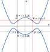

# Double-Odd Curves as Jacobi Quartics

After the initial publication of double-odd curve formulas, it was found
that they can be turned, with a proper change of variable, into another
type of curve equation known as the *Jacobi quartic*. In this alternate
representation, we can have somewhat more efficient formulas for point
doublings, and we can also support a different encoding format for which
point decoding from bytes is more efficient than with the original
double-odd curves.

## Change of Variable

For a double-odd elliptic curve of equation \\(y^2 = x(x^2 + ax + b)\\),
we can consider the following change of variables:
\\[\begin{eqnarray*}
    u &=& \frac{x}{y} \\\\
    e &=& u^2 \left(x - \frac{b}{x}\right)
\end{eqnarray*}\\]

The \\(u\\) coordinate is the inverse of the \\(w\\) coordinate that we
encountered previously; \\(w = y/x\\) is the slope of the line from the
point \\(N\\) of order two, to the point \\(P = (x,u)\\). The \\(u\\)
coordinate has the advantage of being naturally extended to a finite
value (\\(0\\)) for \\(N\\) itself: the tangent to the curve on \\(N\\) is
vertical, so its slope is infinite, but the inverse of the slope should
then be zero. Moreover, there is no other point of order 2, so there is
no point distinct from \\(N\\) where \\(w = 0\\), which means that
\\(u\\) is well-defined.

The \\(e\\) coordinate is also well-defined, since a simple calculation
shows that it is equal to \\((x^2 - b)/(x^2 + ax + b)\\), and neither
the denominator nor the denominator is ever zero for a double-odd curve.
For \\(N\\), the \\(e\\) coordinate is \\(-1\\). We can even extend the
\\((e,u)\\) coordinates to the point-at-infinity \\(\mathbb{O}\\), which
does not have defined \\((x,y)\\) coordinates, by setting \\(e = 1\\)
and \\(u = 0\\) for that point; as will be seen later on, these are the
values that "work well" with the formulas.

The change of variable morphs the curve equation into:
\\[\begin{eqnarray*}
    e^2 = (a^2-4b)u^4 - 2a u^2 + 1
\end{eqnarray*}\\]
which is an equation type known as the Jacobi quartic, and studied by C.
G. J. Jacobi back in the 19th century. This yields a curve shape (when
applied to real numbers) similar to the one shown here. The picture
exhibits some salient features of that curve shape:

  - The point-at-infinity is no longer "at infinity"; it has defined
    coordinates.

  - For a given point \\(P = (e,u)\\), we easily obtain \\(-P = (e,-u)\\),
    \\(P+N = (-e,-u)\\), and \\(-P+N = (-e,u)\\) (this explains why we
    choose \\((1,0)\\) as the coordinates of the point-at-infinity, given
    that \\(N = (-1,0)\\)).

Many formulas for computing point additions on Jacobi quartics have been
discovered over the years; for a good summary, see the paper [Jacobi
Quartic Curves Revisited](https://eprint.iacr.org/2009/312) by Hisil,
Wong, Carter and Dawson. Using their *extended coordinates* (or,
equivalently, the representation [proposed earlier by
Duquesne](https://hal-lirmm.ccsd.cnrs.fr/lirmm-00145805/document), which
is the same system under slightly different notations), we get general
point addition in cost 8M+3S, which is roughly equivalent to the 10M
cost we get with the original double-odd curves in \\((x,u)\\)
coordinates. We get some improvements on doublings:

  - A single point doubling is computed in cost 2M+5S, that can be
    lowered to 1M+6S on many double-odd curves, in particular the
    ones we specify as standard curves (jq255e and jq255s).

  - We can still optimize sequences of doublings, with a per-doubling
    cost of 1M+5S (jq255e) or 2M+4S (jq255s); we could already do that
    with the original double-odd curves, but the overhead for entering
    the sequence is lower (only 1S instead of 3M).

We can thus obtain some performance improvements on computations.

## Enhanced Point Compression

Using \\((e,u)\\) coordinates yields another performance gain, related
to the encoding (aka compression) of points into bytes.

Double-odd curves have order \\(2r\\) for some odd integer \\(r\\); we
of course usually arrange for \\(r\\) to be prime. We want to work with
a prime order group, such as \\(E[r]\\) (the points of \\(r\\)-torsion
on the curve); what we are really using is a *quotient group*: the
quotient of the curve by the subgroup \\(\\{\mathbb{O},N\\}\\). In other
words, a group element is a pair of points \\(\\{P,P+N\\}\\), and the
two points \\(P\\) and \\(P+N\\) both *represent* the same group element.

In the original double-odd curves, we always enforce the use of the
representant which is *not* a point of \\(r\\)-torsion; we do so, as
explained in the [geometrical introduction](intro.md), so that we avoid
the tricky exceptional cases of the traditional addition law on short
Weierstraß curves. When decoding points from their \\(w\\) coordinate,
there are two possible matching points on the curve, but only one of
them is a non-\\(r\\)-torsion point, and we can unambiguously recognize
that point thanks to the fact that the \\(x\\) coordinate of an
\\(r\\)-torsion point is a square in the field, while the \\(x\\)
coordinate of a non-\\(r\\)-torsion point is a non-square.

This scheme works, but it entails computing a Legendre symbol on top of
the square root which is already needed to get the two candidate points
for a given \\(w\\). Jacobi quartics give us a better option which
avoids the cost of that Legendre symbol. Indeed, the choice of the
"right" representant was required because the \\((x,u)\\) formulas are
complete *on the group* but may miscompute things if given points of
\\(r\\)-torsion. *A contrario*, the formulas on double-odd Jacobi
quartics are complete *on the whole curve*: we do not have to select any
specific representant, both will work properly (the completeness of the
formulas does not apply to *all* Jacobi quartics, but it applies to
about half of them, including all double-odd Jacobi quartics). Thus,
instead of using a Legendre symbol, we can employ a much cheaper "sign"
convention (typically, the least significant bit of the representation
of a field element as an integer) to unambiguously encode and decode a
group element.

Unfortunately, this new encoding scheme implies an incompatible change
in the encoding format; we thus define the new groups **jq255e** and
**jq255s**, which are (algebraically) the same groups as do255e
and do255s, but with a modified encoding format. In a nutshell:

  - To encode a point \\(P = (e,u)\\), first select either \\(P\\)
    or \\(P+N = (-e,-u)\\), depending on the "sign" of \\(e\\); i.e.
    we choose the representant of the group element whose \\(e\\)
    coordinate is non-negative. We then encode its \\(u\\) coordinate
    into bytes.

  - To decode a point from its \\(u\\) coordinate, we compute \\(e^2\\)
    from the curve equation (\\(e^2 = (a^2-4b)u^4 - 2au^2 + 1\\)),
    then extract its square root to get \\(e\\). There are two solutions;
    we simply choose the non-negative one.

This improved encoding format has some definite advantages. We can
compare it with the compression and decompression procedures used in the
original double-odd curve specifications, as well as what is done in
twisted Edwards curves, and their cofactor-eliminated variants
Decaf/Ristretto:

  - In double-odd Jacobi quartics, decompression only involves a square
    root computation; the Legendre symbol computation is eliminated.
    While the Legendre symbol can be significantly cheaper than a square
    root (down to 1/6th of the cost in small microcontrollers), not
    computing it at all is even cheaper. This makes decompression
    as efficient as in twisted Edwards curves and Decaf/Ristretto.

  - Our new decompression method naturally yields affine \\((e,u)\\)
    coordinates; there is no need to smuggle an extra inversion in the
    modular exponentation that is at the root of the square root
    computation. In that sense, it is even slightly *simpler* than
    in twisted Edwards curves and Decaf/Ristretto.

  - Encoding (compression) is immediate. In practice, starting from a
    point in extended coordinates, a normalization is required, which
    involves an inversion in the field. This is equivalent to twisted
    Edwards curves, but more efficient than Decaf/Ristretto compression,
    which requires a combined inversion/square root computation. On
    small microcontrollers, inversion can be quite faster than square
    roots (down to 1/5th of the cost); on large systems, batch inversion
    can be thoroughly optimized, while batch square root cannot.

## Summary

The introduction of the \\((e,u)\\) coordinates can be summarized as
follows:

  - We get an improved decoding mechanism, which is faster, and easier
    to implement.

  - We still have decently fast general point addition formulas.

  - Point doublings get faster, which improves performance.

  - Since the decoding formulas have changed, we formally get new
    prime-order groups, called *jq255e* and *jq255s*.

Since jq255e and jq255s are new groups, we take the opportunity to
redefine the cryptographic schemes that operate on them (signatures, key
exchange), to replace the SHAKE function with
[BLAKE2s](https://www.blake2.net/), which is somewhat less versatile,
but a good deal faster, especially on small 32-bit microcontrollers.
More importantly, we also make signatures smaller (48 bytes instead of
64) and, as a side effect, faster as well, as explined in the [Short
Signatures](shortsig.md) section.
